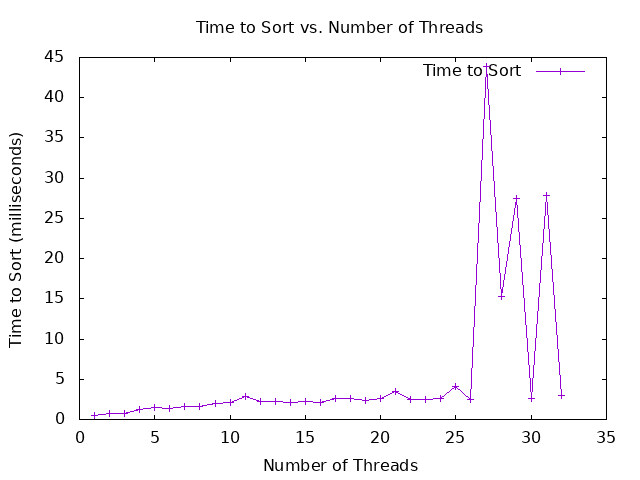

For this project, I implemented a multithreaded mergesort algorithm and evaluated its performance by comparing execution times across different thread counts. The primary goal was to observe the effect of increasing the number of threads on the sorting speed and to identify an optimal number of threads for my machine. Unfortunately, the performance results did not align with the expected pattern shown in the example graph. Below, I’ll detail my observations, hypothesize reasons for the discrepancies, and reflect on potential areas for improvement.

## Observed Performance and Graph Discrepancies:
Unlike the example graph, which typically shows a clear improvement in performance as the number of threads increases (up to a point where it plateaus), my graph exhibited a far more erratic trend. While the sorting process itself was consistently accurate in producing sorted arrays, the runtime did not decrease predictably with additional threads. In fact, at certain thread counts, the runtime even increased unexpectedly, hinting at potential inefficiencies in the implementation.

## Potential Memory Leak:
Through careful review, I suspect a memory leak might be affecting the performance. This could be occurring due to improper allocation or deallocation of resources in the multithreaded implementation, particularly in the thread arguments or the temporary arrays used for merging. A memory leak would lead to inefficient use of memory, which could significantly slow down the program, especially as the thread count rises and more memory is consumed. However I never found it.

## Performance Slowdown:
At higher thread counts, I noticed a clear slowdown, contrary to the intended speed-up. This could stem from the overhead of managing a large number of threads, as well as potential contention for shared resources (such as memory or CPU cache). In a properly optimized version, I would expect a performance boost up to a certain number of threads, after which the returns should diminish. In this case, however, the slowdown began sooner and was more pronounced, likely exacerbated by the suspected memory management issues.

## Optimal and Slowest Thread Counts:
Given the inconsistent performance, it was difficult to pinpoint an "optimal" number of threads. For my machine, lower thread counts (such as 2 or 4) tended to produce faster results than higher counts, which should not be the case in an ideal setup. The slowest execution times were observed when the thread count approached the upper limit, which again suggests that excessive threading introduced more overhead than benefit.

## Reflection on Implementation:
I suspect that the issues in the current implementation are largely related to memory handling. Although the sorting functionality is correct, there may be flaws in the way memory is allocated, used, and freed during multithreaded execution. This hypothesis aligns with the performance pattern observed, as memory leaks and inefficient memory access would compound the slowdown as more threads are added.

## Lessons Learned and Next Steps:
This project underscored the importance of careful memory management in parallelized code. Moving forward, I plan to further investigate and address the memory leak and explore more efficient memory allocation strategies for multithreaded applications. Correcting these issues should allow for more reliable performance gains with additional threads, and I anticipate that this change would produce a graph closer to the expected pattern. Debugging multithreaded programs can be challenging, but I am confident that identifying and fixing these issues will yield substantial improvements in the sorting program’s performance.

In conclusion, while the mergesort algorithm correctly sorted the arrays, the current implementation did not achieve the desired performance improvements due to suspected memory leaks and inefficiencies in thread handling. Further debugging and optimization will be essential to realize the full potential of the multithreaded approach.